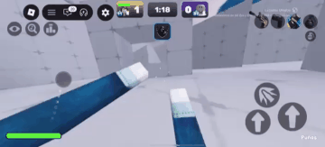

---

# BlueX

<p align="center">
  
</p>

<p align="center">
  
  
  
  <a href="https://instagram.com/0xffff00"></a>
</p>

---

## ⚡ Quick Installation

Copy & paste this line inside your Roblox executor:

```lua
loadstring(game:HttpGet("https://raw.githubusercontent.com/Th1iago3/BlueX/refs/heads/main/BlueX.lua"))()
```

Done! BlueX will load automatically.

---

## ✨ Main Features

### 🎯 **Advanced Aimbot**

* Movement prediction (speed, acceleration, ping-based).
* Configurable smoothing for natural aim.
* Priority options (distance, health, hybrid).
* Adjustable FOV (Field of View).
* ESP Charms (see enemies through walls).

### 👀 **Visibility Check**

* Raycast ensures aim only locks on visible enemies.
* Ignores objects between you and target.

### 🤝 **Team Control**

* Automatic teammate detection.
* **Team Check** (toggle on/off).
* Manual “Friend Selection” via GUI.

### 🔫 **Weapon Enhancements**

* Removes recoil, spread & kick.
* Optimized fire rate for faster shots.

### 🖥️ **Clean Graphical Interface (GUI)**

* Open with **RightShift**.
* Toggle Aimbot with **Q**.
* Sliders for Prediction & Smooth Aim.
* Drag-and-drop intuitive design.

---

## 🎮 In-Game Preview

<p align="center">
  
</p>

<p align="center">
  
</p>

---

## 🎮 How to Use

1. Open your script executor in Roblox.
2. Paste the **Quick Installation** command.
3. Use hotkeys:

   * `RightShift` → Open/close GUI.
   * `Q` → Toggle Aimbot.
   * `F6` → Toggle ESP Charms.
4. Customize settings in the menu.

---

## ⚙️ Available Settings

* **Prediction** → Adjusts target movement prediction.
* **Smooth Speed** → Controls aiming smoothness.
* **Team Check** → Automatically ignores teammates.
* **Manual Team Check** → Manually exclude selected players.
* **Aim Part** → Choose target body part (default: Head).
* **ESP Charms** → Highlights enemies through walls (default: white).

---

## 🧩 Troubleshooting

<details>
<summary><strong>GUI not showing?</strong></summary>

* Make sure you pressed **RightShift**.
* Check if your executor supports `getrawmetatable`, `gethiddenproperty`, and `sethiddenproperty`.

</details>

<details>
<summary><strong>Aimbot not aiming correctly?</strong></summary>

* Increase **Prediction** for fast-moving enemies.
* Lower **Smooth Speed** if the aim feels too slow.

</details>

---

## 🔐 Disclaimer

This project is provided **“as is”**, without warranties.
Use at your own risk ⚠️.

---

<p align="center">
  
</p>

<p align="center">
  Made with ❤️ by <a href="https://github.com/Th1iago3">Th1iago3</a><br/>
  📷 Instagram: <a href="https://instagram.com/0xffff00">@0xffff00</a>
</p>

---
