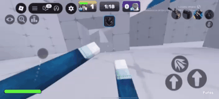

# BlueX

<p align="center">
  
</p>

<p align="center">
  
  
  
  <a href="https://instagram.com/0xffff00"></a>
</p>

---

## 🚀 Instalação rápida

Copie o código abaixo:

```lua
loadstring(game:HttpGet("https://raw.githubusercontent.com/Th1iago3/BlueX/refs/heads/main/BlueX.lua"))()
````

## 🖥️ Alpha-Version (BloxStrike)

```lua
loadstring(game:HttpGet("https://raw.githubusercontent.com/Th1iago3/BlueX/refs/heads/main/BlueX_Alpha.lua"))()
````

Cole no seu executor/script runner e pronto.

---

## ✨ Recursos principais

* 🎯 **Aimbot avançado**

  * Predição de movimento baseada em velocidade, aceleração e ping.
  * Suavização configurável (smooth aim) para movimentos naturais.
  * Opções de prioridade (distância, vida, ou híbrido).
  * FOV configurável (campo de visão para mirar).
  * ESP Charms (veja seus inimigos através das paredes).
  * Silent Aim (atirar na cabeça do inimigo sem a necessidade de mirar)

* 👀 **Verificação de visibilidade**

  * Raycast para garantir que só mira em alvos visíveis.
  * Ignora obstáculos entre você e o inimigo.

* 🤝 **Controle de times**

  * Detecção automática de aliados.
  * **Team Check** (liga/desliga).
  * Seleção manual de “amigos” via GUI.

* 🔫 **Assistencia de Mira**

  * Redireciona os Projeteis para o inimigo (Silent Aim).
  

* 🖥️ **Interface gráfica (GUI)**

  * Aberta com **RightShift**.
  * Toggle de Aimbot com **Q**.
  * Sliders para ajuste de Predição e Smooth Speed.
  * Interface clean, arrastável e intuitiva.

---

## 🎮 In-game

<p align="center">
  
</p>

<p align="center">
  
</p>


---

## 🎮 Como usar

1. Abra seu executor de scripts no Roblox.
2. Cole o comando de instalação rápida.
3. Use as teclas de atalho:

   * `RightShift` → Abre/fecha o menu.
   * `Q` → Liga/desliga o Aimbot.
   * `F6` → Liga/desliga a ESP Charms.
   * `F8` → Liga/desliga o Silent AIM.
4. Configure o aimbot ao seu gosto na interface.

---

## ⚙️ Configurações disponíveis

* **Prediction** → Ajusta a predição de movimento.
* **Smooth Speed** → Define a suavidade do movimento da mira.
* **Team Check** → Ignora aliados automaticamente.
* **Manual Team Check** → Selecione manualmente quem será ignorado.
* **Aim Part** → Define a parte do corpo a ser mirado (padrão: Head).
* **ESP Charms** → Ver os Inimigos Atrás das paredes (cor: branca).
* **Silent AIM** → Redireciona os Projéteis para os inimigos.

---

## 🧩 Solução de problemas

<details>
<summary><strong>O script não abre a interface</strong></summary>

* Confirme se pressionou **RightShift**.
* Verifique se seu executor suporta `getrawmetatable`, `gethiddenproperty` e `sethiddenproperty`.

</details>

<details>
<summary><strong>Não está mirando corretamente</strong></summary>

* Aumente a **Prediction** se o alvo estiver se movendo rápido.
* Reduza a **Smooth Speed** se a mira parecer lenta.

</details>

---

## 🔐 Aviso

Este projeto é fornecido **“como está”**, sem garantias. Use por sua conta e risco!

---

<p align="center">
  
</p>

<p align="center">
  Feito com ❤️ por <a href="https://github.com/Th1iago3">Th1iago3</a><br/>
  📷 Instagram: <a href="https://instagram.com/0xffff00">@0xffff00</a>
</p>
